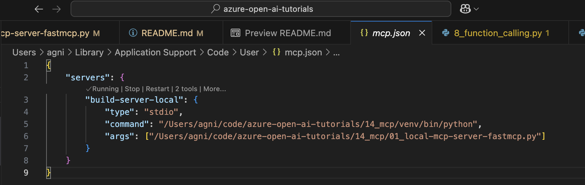

# Model Context Protocol

## What is Model Context Protocol (MCP)?

MCP is a protocol that allows AI systems (like Copilot, Windsurf or any custom AI solution) to access your functions.

- **Without MCP** - functions you write can only be used within your own code.
- **With MCP** - functions become accessible to other AI systems

MCP isn't a revolutionary new technology - it's a new standard. If you've been working with AI systems/agents for any length of time, you've already been implementing the core concept: giving LLMs access to tools through function calling. What's different is that MCP provides a standardized protocol for these interactions.

### Tools vs Functions:
Tools = function that are made available to LLMs

## How to expose your tools via MCP?

1. Define your function as you normally would.
1. Add docstring to your functions
1. Create an MCP server to make the functions available to the World.

Unfortunately, creating an MCP server from scratch involves writing a lot of boilerplate code.

Enter **FastMCP** - A Python library that simplifies the process of creating MCP servers.
FastMCP handles all the complex protocol details and server management, so you can focus on writing functions. In most cases, adding FastMCP provided decorators to your functions is all you need.

### Simple MCP Server Setup with FastMCP in Python

```python
# server.py
from fastmcp import FastMCP

# ----------------------------------------------
# Step 1: Instantiate an MCP server. 
# ----------------------------------------------
mcp = FastMCP("DemoServer")

# ----------------------------------------------
# Step 2: To all the function you wish to expose via MCP,
# add the @mcp.tool() decorator.
# ----------------------------------------------
@mcp.tool()
def say_hello(name: str) -> str:
    """Say hello to someone

    Args:
        name: The person's name to greet
    """
    return f"Hello, {name}! Nice to meet you."

# ----------------------------------------------
# Step 3: Run the FastMCP server by calling 
# the run() method on the server instance
# ----------------------------------------------
if __name__ == "__main__":
    mcp.run()
```

### Transport protocols
MCP servers communicate with clients through different transport protocols. Think of transports as the “language” your server speaks to communicate with clients.

FastMCP supports three transport protocols: **stdio**, **http**, and **sse**

- **stdio transport**: The server communicates through standard input and output 
    ```python
    mcp.run(transport="stdio")  # Default, so transport argument is optional
    ```
    Use `stdio` if your client and MCP server are running in the same machine.

- **Streamable HTTP**: HTTP transport turns your MCP server into a web service accessible via a URL
    ```python
    # Start an HTTP server on port 8000
    mcp.run(transport="http", host="127.0.0.1", port=8000, path="/mcp")
    ```
    Use `http` if you want to expose your MCP server over HTTP

- **SSE** Old technology, use Streamable HTTP instead.
    ```python
    mcp.run(transport="sse", host="127.0.0.1", port=8000, path="/mcp")
    ```

## How to consume MCP servers
1. **Personal MCP use** - Adding MCP servers to Copilot, Windsurf, Cursor, or other personal AI assistants
1. **Backend integration** - Adding MCP servers into your Python applications and agent systems

### Examples

To add an MCP server to an AI assistant, you’ll need to create a `mcp.json` file. This file should define the server schema with the following details:

* **Name**: The name of the MCP server.
* **Command & Args**: The command used to run the server. If using `stdio`, make sure to provide the absolute path.

Refer to your AI assistant’s documentation to determine the correct location for placing the `mcp.json` file.

<table>
<tr>
<td> MCP Server File </td> 
<td> Copilot `mcp.json` </td>
<td> Windsurf `mcp.json` </td>
<td> Notes </td>
</tr>
<tr>
<td> 01_local-mcp-server-fastmcp.py </td>
<td>


```json
{
	"servers": {
		"build-server-local": {
			"command": "/Users/agni/code/azure-open-ai-tutorials/14_mcp/venv/bin/python",
			"args": ["/Users/agni/code/azure-open-ai-tutorials/14_mcp/01_local-mcp-server-fastmcp.py"]
		}
	}
}
```


</td>
<td>

```json
{
	"mcpServers": {
		"build-server-local": {
			"command": "/Users/agni/code/azure-open-ai-tutorials/14_mcp/venv/bin/python",
			"args": ["/Users/agni/code/azure-open-ai-tutorials/14_mcp/01_local-mcp-server-fastmcp.py"]
		}
	}
}
```

</td>
<td>
    <ul>
        <li>Provide absolute paths in `command` and `args`</li>
        <li>Use the python from your virtual environment in `command`</li>
    </ul>
</td>
</tr>
</table>

### Screenshots

Below are screenshots showing the `mcp.json` configuration for VSCode Copilot for the local MCP server defined in `01_local-mcp-server-fastmcp.py`:


<br><br>

<br><br>


## MCP advantages over Function Calling

The true power of MCP isn't in introducing new capabilities, but in standardizing how these capabilities are exposed and consumed. This provides several key advantages:

- **Reusability:** Build a server once, use it with any MCP-compatible client
- **Composability:** Combine multiple servers to create complex capabilities
- **Ecosystem growth:** Benefit from servers created by others

The MCP ecosystem is already growing rapidly, with servers available many tools. You can find an overview here: [Officially supported servers](https://github.com/modelcontextprotocol/servers)

This means you can leverage existing servers rather than reinventing the wheel, and contribute your own servers to benefit the community.