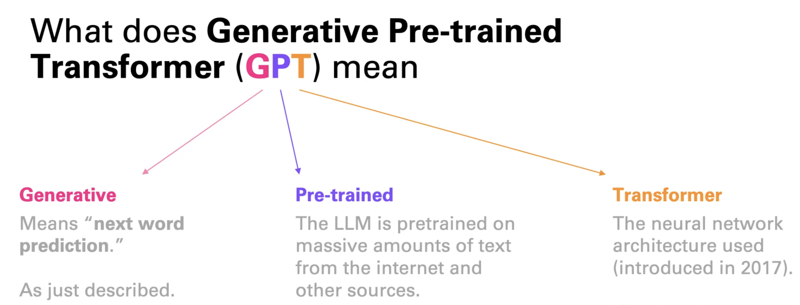
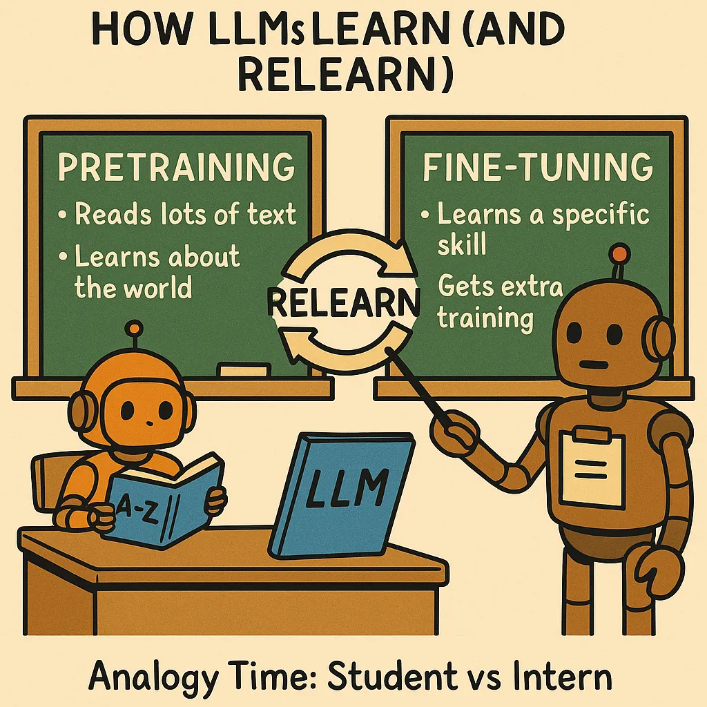

# How Large Language Models (LLMs) Work

## LLMs are fancy autocomplete systems

LLMs such as OpenAI’s ChatGPT and Anthropic’s Claude are AI-powered assistants. When you give them a query or instruction — called a `prompt` — they generate a response tailored to that input.
 
<br>

Here’s how LLM works: when you give an LLM a prompt, it generates text - one word at a time. After predicting a word, it adds that word to the prompt and uses the updated prompt to predict the next word. This process repeats again and again until it produces a full response.


This basically means that LLMs are just autocomplete systems trained to predict the next word in a sequence based on the words that came before it. This is similar to how your phone's keyboard suggests the next word as you type a message.

<br>

So why do LLMs seem so smart while your phone’s autocomplete can feel… well, silly? The difference comes down to training. LLMs are trained on massive datasets containing trillions of words -- allowing them to learn complex patterns and relationships between words. This enables them to generate coherent and contextually relevant responses.

## How do LLMs learn? A beginner's guide to tokens, embeddings, pretraining, and fine-tuning

Imagine you’re trying to teach a computer what the word “dog” means. To you, “dog” brings up images of a wagging tail, barking, or a furry pet. But to a computer, it’s just a random string of letters: D-O-G. Computers love numbers, not words, so we need a way to turn words into something they can work with.

The first idea is to assign each word a unique number, like “cat” = 17, “dog” = 42, “banana” = 99. This is called `tokenization`, where each entity is called a `token` and the number representing it is called its `token ID`.

| Token   | Token ID |
|---------|----------|
| cat     | 17       |
| dog     | 42       |
| banana  | 99       |

For simplicity, we’re considering whole words as tokens. In reality, however, a token could be a full word (`dog`), part of a word (`ing` in `running`), punctuation (`.` or `,`), or even a single character in some cases.

Here's a real demonstration of how the sentence "I love pizza!" is tokenized in GPT-4o:
```
"I love pizza!" -> ["I", " love", " pizza", "!"] -> [40, 3047, 27941, 0]
```

<br>
<br>

Note that the token IDs like "42" for "dog" and "17" for "cat" are just unique labels — they don’t tell the computer anything about how the words are related. Token IDs are like jersey numbers: useful for identification, but meaningless for understanding.

**What we want**: A way to represent words so the computer knows:
  - “Dog” and “puppy” are similar (both are animals).
  - “King” and “queen” are related (both are royalty).
  - “Apple” and “car” are totally different.

### Solution: Word embeddings!

To help the computer understand relationships between tokens, each token ID is mapped to **an array of numbers** called an `embedding vector`. These vectors capture the meaning and context of each token.

For example (using made-up numbers):

| Token   | Token ID | Embedding Vector     |
|---------|----------|----------------------|
| cat     | 17       | [0.8, 0.8]           |
| dog     | 42       | [0.7, 0.7]           |
| banana  | 99       | [-0.6, 0.5]          |

If we plot these vectors in a 2D space, you’d see that “cat” and “dog” are close together, while “banana” is far away.
<br><br><br>

- The vectors for "cat" and "dog" are similar, so the model knows they’re related (both are animals).
- The vector for "banana" is different, so the model knows it’s not related to "cat" or "dog" (it’s fruit).

LLMs use thousands of dimensions (not just 2), like a 3D, 4D, or even 1000D map, to capture super detailed relationships.

| Token   | Token ID | Embedding Vector (Made up numbers for illustration)                         |
|---------|----------|-----------------------------------------------------------------------------|
| cat     | 17       | [0.8, 0.2, 0.1, 0.5, 0.9, 0.3, 0.4, 0.6, 0.2, 0.8, 0.1, 0.7, 0.4, 0.5, 0.3] |
| dog     | 42       | [0.7, 0.3, 0.2, 0.4, 0.8, 0.1, 0.6, 0.5, 0.2, 0.9, 0.3, 0.4, 0.5, 0.6, 0.7] |
| banana  | 99       | [0.1, 0.9, 0.5, 0.3, 0.2, 0.8, 0.4, 0.6, 0.7, 0.1, 0.5, 0.9, 0.3, 0.2, 0.4] |

Don’t be scared about “dimensions”—they’re just a set of numbers to describe a word (e.g., is it an animal? Positive? Food-related?).

### How Embeddings are generated?
Okay, so we need these embeddings for words. But how do we make them?

LLMs use a process called `pretraining`. Here’s a simplified version of how it works:

- The LLM scans a massive pile of text (like Wikipedia, books, or social media) and lists all unique tokens. Say it finds 50,000 tokens.
- Each token is assigned a random embedding, like [0.1, -0.4, 0.7] for “cat.”
- From the input text, a sentence is picked, for example, “The cat sat on the mat”
- Although we know the next word in "The cat sat on the" is “mat,” the LLM is asked to predict it. Ex: "The cat sat on the __"
- The LLM uses the current embeddings of "The", "cat", "sat", "on" and "the" to predict the next token. If it’s wrong, it tweaks the embedding numbers slightly to increase the probablity of getting "mat" as the answer next time.
- This process repeats billions of times, with the LLM adjusting embeddings and weights to get better at predicting missing tokens.

    <br>

**Key Terms one should know**:
- **Weights**: Weights are like dials that control how much attention each token pays to others. In “The cat chased the dog,” the model learns to give more weight to “chased” when shaping “cat”’s embedding, so it reflects the action. 
- **Context Window**: The number of tokens the model can consider at once when predicting the next token. For example, if the context window is 128K tokens, the model looks at the last 128K tokens to predict the next one. In the above example, the context window is 5 tokens: ["The", "cat", "sat", "on", "the"].
- **Backpropagation**: The method used to update the weights and embeddings based on the error of the prediction. Its a feedback loop that helps the model learn from its mistakes.
- **Model parameters**: Model Parameters = the numbers in token embeddings (e.g., [0.7, -0.2, 0.9] for “cat”) + weights.
    - Variables that the model adjusts during training to improve prediction accuracy.
    - The more parameters an LLM has, the more it can “remember” about language patterns.

**Notes**:
- Pretraining is unsupervised learning because the model learns from raw text without labeled answers.
- Models don’t just adjust embeddings — they primarily adjust the weights. For accurate predictions, weight adjustments are more crucial than embedding tweaks.
- LLM models do not store or retain copies of the data they are trained on. Instead, models learn from the data to predict the next token with greater accuracy.

## The Transformer Algorithm
This is the algorithm that all modern LLMs are based on. This algorithm was introduced in 2017 in a paper called [“Attention Is All You Need”](https://proceedings.neurips.cc/paper/2017/file/3f5ee243547dee91fbd053c1c4a845aa-Paper.pdf).

<br>

**Advantages of Transformer Algorithm over previous ones**:
- **Self-attention:** Rather than considering one token at a time to predict the next token, Transformers considers all tokens in its context window at once to figure out how they connect. Examples:
    - In “The cat chased the dog,” the Transformer notices the token “cat” is linked to “chased” and “dog,” not just nearby tokens. 
    - In Transformer algorithm, the token “cat” is understood differently in “The cat chased the dog” (hunter vibe) vs. “I pet the cat” (cuddly vibe).

    It’s like reading the whole sentence to get the full story.

- **Positional encodings:** Transformers also care about token order. Transformer understands that “The cat chased the dog” is different from “The dog chased the cat.”

### The base model - the result of pretraining
After pretraining, the model that is generated is known as the **base model**, **foundation model** or **pretrained model**. 

Pretraining is when an LLM reads almost the entire internet. It learns:
- What words follow other words
- How sentences are structured
- That “pizza is tasty” is more likely than “pizza is a calculator”

It learns everything — helpful, weird, and messy.

Think of it as the AI’s childhood. Lots of reading. No real-world application yet.

This base model can then be fine-tuned on specific tasks (like answering questions, writing code, etc.) using smaller, task-specific datasets.

### Fine-tuning

Fine-tuning helps the model behave in targeted ways.

<br>

In fine-tuning, you take the pretrained model and give it specific examples:
- “Here’s how a customer service agent talks.”
- “Here’s how legal summaries are written.”
- “Here’s how not to insult someone accidentally.”

It’s like sending a kid to a special camp for writing email replies or answering tech support calls.

Some examples of fine-tuning methods:
- **Supervised fine-tuning**: Provide examples of correct responses to prompts to guide the model's behavior.
- **Direct preference optimization (DPO)**: Provide a preferred and non-preferred responses for a prompt, and optimizing the model to favor the preferred response
- **Reinforcement learning from human feedback (RLHF)**: The model generates *multiple* outputs, and humans select the best one. The model learns to prefer responses that humans like.

### References
- [Deep Dive into LLMs like ChatGPT - YouTube](https://www.youtube.com/watch?v=7xTGNNLPyMI) - Andrej Karpathy, one of founding members of OpenAI, dropped a 3-hour, 31-minute deep dive on LLMs — a goldmine of information.
- [Understanding how words are converted to numbers - YouTube](https://www.youtube.com/watch?v=viZrOnJclY0) - The tutorial is based on Word2Vec - an older algorithm, but the concepts of tokens and embeddings are similar.

## LLMs generate probabilities, not words

When you ask an LLM a question, it doesn’t actually “know” the answer in the way a human does. Instead, based on its training data and based on the context of your prompt, it generates a list of possible next token along with their probabilities.

Let's say you ask an LLM: "The capital of France is ___"

The LLM doesn't just think "Paris". Instead, it thinks something like this:

<br>

**Every single token** in its vocabulary (which can be 50,000+ words!) gets a probability score based on how likely it is to be the next word in the sequence.

Think of it like your brain when someone asks "What's your favorite color?" You might immediately think "blue," but your brain also considers "red," "green," etc. — just with lower confidence.

### LLM doesn't always pick the highest probability word!

The most obvious strategy is to always pick the word with the highest probability (known as greedy sampling). However, LLMs don't always do this. Here's why:

1. **Repetition would be boring** : If LLMs always picked the most likely word, they'd be incredibly predictable and repetitive. Every time you ask "My favorite animal is a ___", you'd always get "dog." That's not very interesting!

2. **Real conversations aren't predictable**: Humans don't always say the most predictable thing. Sometimes we're creative, surprising, or take unexpected turns in conversation. LLMs try to mimic this natural variety.

**Different situations call for different approaches**
- For creative writing, you want more surprises and variety
- For factual questions, you want more predictable, accurate answers

### Temperature: The creativity dial

This is where **temperature** comes in. Temperature is like a creativity dial that controls how "adventurous" the LLM gets when picking words.

**0 temperature**
- The LLM always picks the highest-probability word (greedy sampling)

**Low temperature (0.1-0.3): Conservative and predictable**
- The LLM almost always picks high-probability words
- More factual and consistent responses
- Good for answering questions or writing formal documents

**High temperature (0.7-1.0+): Creative and unpredictable**
- The LLM considers lower-probability words more seriously  
- More creative and varied responses
- Good for creative writing or brainstorming

<video controls src="images/6ht56x.mp4" title="Temperature Explained"></video>


### Other Sampling Strategies

1. **Top-k sampling**: Top K sets a hard limit on how many tokens can be selected. So top_k = 5 would mean you only allow the model to pick from the top 5 candidates and nothing else. This is considered a very "naive" and simplistic way to truncate choices.
2. **Top-p sampling**: Top P adds up the topmost tokens until hitting a target percentage. So for example, if you have 25%, 25%, 12.5%, 12.5%, and top_p = 0.50, it will only consider the top two candiates.

These methods ensure the LLM stays reasonable (doesn't pick "pizza" as an animal) while still allowing for creativity and variety.

### Why this matters

Understanding that LLMs work with probabilities helps explain:
- **Why you get different answers**: Even with the same prompt, the LLM might pick different probable words each time
- **Why they sometimes make mistakes**: A wrong answer might have seemed "probable" based on the context
- **Why they can be creative**: They're not just retrieving stored answers — they're generating based on learned patterns

## References
- https://medium.com/@amgad-hasan/explaining-how-llms-work-in-7-levels-of-abstraction-3179de558686
- https://gist.github.com/kalomaze/4473f3f975ff5e5fade06e632498f73e


