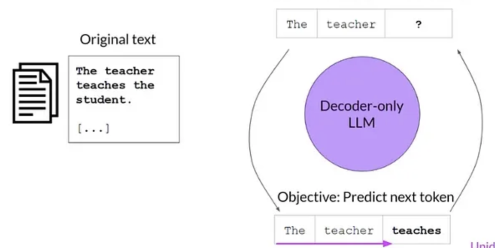
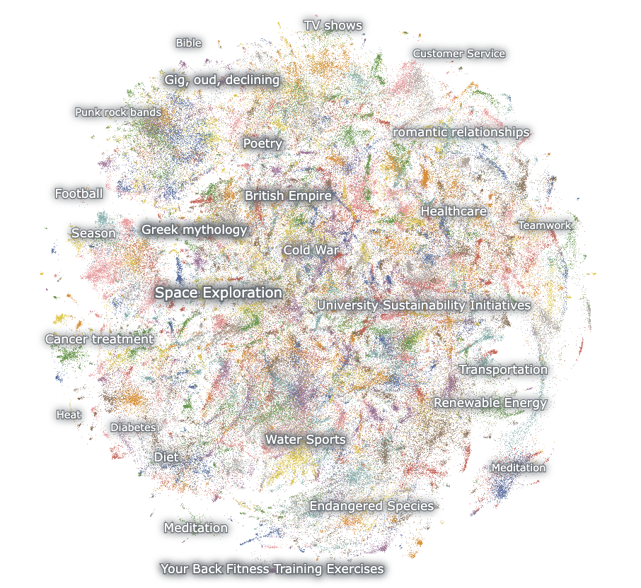

# How Large Language Models (LLMs) Work

## LLMs are fancy autocomplete systems

LLMs such as OpenAI’s ChatGPT and Anthropic’s Claude are AI-powered assistants. When you give them a query or instruction — called a `prompt` — they generate a response tailored to that input.
 
<br>

Here’s how LLM works: when you give an LLM a prompt, it generates text - one word at a time. After predicting a word, it adds that word to the prompt and uses the updated prompt to predict the next word. This process repeats again and again until it produces a full response.


This basically means that LLMs are just autocomplete systems trained to predict the next word in a sequence based on the words that came before it. This is similar to how your phone's keyboard suggests the next word as you type a message.

<br>

So why do LLMs seem so smart while your phone’s autocomplete can feel… well, silly? The difference comes down to training. LLMs are trained on massive datasets containing trillions of words -- allowing them to learn complex patterns and relationships between words. This enables them to generate coherent and contextually relevant responses.

## How do LLMs learn? A beginner's guide to tokens, embeddings, pretraining, and fine-tuning

Imagine you’re trying to teach a computer what the word “dog” means. To you, “dog” brings up images of a wagging tail, barking, or a furry pet. But to a computer, it’s just a random string of letters: D-O-G. Computers love numbers, not words, so we need a way to turn words into something they can work with.

The first idea is to assign each word a unique number, like “cat” = 17, “dog” = 42, “banana” = 99. This is called `tokenization`, where each entity is called a `token` and the number representing it is called its `token ID`.

| Token   | Token ID |
|---------|----------|
| cat     | 17       |
| dog     | 42       |
| banana  | 99       |

For simplicity, we’re considering whole words as tokens. In reality, however, a token could be a full word (`dog`), part of a word (`ing` in `running`), punctuation (`.` or `,`), or even a single character in some cases.

Here's a real demonstration of how the sentence "I love pizza!" is tokenized in GPT-4o:
```
"I love pizza!" -> ["I", " love", " pizza", "!"] -> [40, 3047, 27941, 0]
```

<br>
<br>

Note that the token IDs like "42" for "dog" and "17" for "cat" are just unique labels — they don’t tell the computer anything about how the words are related. Token IDs are like jersey numbers: useful for identification, but meaningless for understanding.

**What we want**: A way to represent words so the computer knows:
  - “Dog” and “puppy” are similar (both are animals).
  - “King” and “queen” are related (both are royalty).
  - “Apple” and “car” are totally different.

### Solution: Word embeddings!

To help the computer understand relationships between tokens, each token ID is mapped to a list of numbers called an **embedding vector**. These vectors capture the meaning and context of each token.

For example (using made-up numbers):

| Token   | Token ID | Embedding Vector     |
|---------|----------|----------------------|
| cat     | 17       | [0.8, 0.8]           |
| dog     | 42       | [0.7, 0.7]           |
| banana  | 99       | [-0.6, 0.5]          |

If we plot these vectors in a 2D space, you’d see that “cat” and “dog” are close together, while “banana” is far away.
<br><br><br>

- The vectors for "cat" and "dog" are similar, so the model knows they’re related (both are animals).
- The vector for "banana" is different, so the model knows it’s not related to "cat" or "dog" (it’s fruit).

LLMs use hundreds of dimensions (not just 2), like a 3D, 4D, or even 10,000D map, to capture super detailed relationships. 

| Token   | Token ID | Embedding Vector (Made up numbers for illustration)                         |
|---------|----------|-----------------------------------------------------------------------------|
| cat     | 17       | [0.8, 0.2, 0.1, 0.5, 0.9, 0.3, 0.4, 0.6, 0.2, 0.8, 0.1, 0.7, 0.4, 0.5, 0.3] |
| dog     | 42       | [0.7, 0.3, 0.2, 0.4, 0.8, 0.1, 0.6, 0.5, 0.2, 0.9, 0.3, 0.4, 0.5, 0.6, 0.7] |
| banana  | 99       | [0.1, 0.9, 0.5, 0.3, 0.2, 0.8, 0.4, 0.6, 0.7, 0.1, 0.5, 0.9, 0.3, 0.2, 0.4] |

Don’t worry about “dimensions”—they’re just a set of numbers to describe a word (e.g., is it an animal? Positive? Food-related?).

### How Embeddings are generated?
Okay, so we need these embeddings for words. But how do we make them?

LLMs use a process called `pretraining`. Here’s a simplified version of how it works:

- The LLM scans a massive pile of text (like Wikipedia, books, or social media) and lists all unique tokens. Say it finds 50,000 tokens.
- Each token is assigned a random embedding, like [0.1, -0.4, 0.7] for “cat.”
- From the input text, a sentence is picked, for example, “The cat sat on the mat”
- Although we know the next word in "The cat sat on the" is “mat,” the LLM is asked to predict it. Ex: "The cat sat on the __"
- The LLM uses the current embeddings of "The", "cat", "sat", "on" and "the" to predict the next token. If it’s wrong, it tweaks the embedding numbers slightly to increase the probablity of getting "mat" as the answer next time.
- This process repeats billions of times, with the LLM adjusting embeddings and weights to get better at predicting missing tokens.

    <br>

**Key Terms one should know**:
- **Weights**: Weights are like dials that control how much attention each token pays to others. In “The cat chased the dog,” the model learns to give more weight to “chased” when shaping “cat”’s embedding, so it reflects the action. 
- **Backpropagation**: The method used to update the weights and embeddings. Its a feedback loop that helps the model learn from its mistakes.
- **Model parameters**: Model Parameters = the numbers in token embeddings (e.g., [0.7, -0.2, 0.9] for “cat”) + weights. 
    - Variables that the model adjusts during training to improve prediction accuracy.
    - The more parameters an LLM has, the more it can “remember” about language patterns.
- **The Transformer Algorithm**: This is the algorithm that all modern LLMs are based on. This algorithm was introduced in 2017 in a paper called “Attention Is All You Need”.

<em> These models do not store or retain copies of the data they are trained on. Instead, as the model learns, its parameters are adjusted to predict the next token with greater accuracy.</em>

<br>

### The base model - the result of pretraining
After pretraining, the model that is generated is known as a **base model**, **foundation model** or **pretrained model**. 

Pretraining is when an LLM reads almost the entire internet. It learns:
- What words follow other words
- How sentences are structured
- That “pizza is tasty” is more likely than “pizza is a calculator”

It learns everything — helpful, weird, and messy.

Think of it as the AI’s childhood. Lots of reading. No real-world application yet.

This base model can then be fine-tuned on specific tasks (like answering questions, writing code, etc.) using smaller, task-specific datasets.

### Fine-tuning

Fine-tuning helps the model behave in targeted ways.

<br>

In fine-tuning, you take the pretrained model and give it specific examples:
- “Here’s how a customer service agent talks.”
- “Here’s how legal summaries are written.”
- “Here’s how not to insult someone accidentally.”

It’s like sending a kid to a special camp for writing email replies or answering tech support calls.

Some examples of fine-tuning methods:
- **Supervised fine-tuning**: Provide examples of correct responses to prompts to guide the model's behavior.
- **Direct preference optimization (DPO)**: Provide a preferred and non-preferred responses for a prompt, and optimizing the model to favor the preferred response
- **Reinforcement learning from human feedback (RLHF)**: The model generates *multiple* outputs, and humans select the best one. The model learns to prefer responses that humans like.

### References
- [Deep Dive into LLMs like ChatGPT - YouTube](https://www.youtube.com/watch?v=7xTGNNLPyMI) - Andrej Karpathy, one of cofounder of OpenAI, dropped a 3-hour, 31-minute deep dive on LLMs — a goldmine of information.
- [Understanding how words are converted to numbers - YouTube](https://www.youtube.com/watch?v=viZrOnJclY0) - The tutorial is based on Word2Vec - an older algorithm, but the concepts of tokens and embeddings are similar.


## LLMs operate on tokens, not words

Saying that LLMs predict the next `word` is not actually accurate. LLMs don’t see words. They have never seen a word. What they see are called `tokens`. A token is the smallest unit of text that a LLM can understand, read, process and respond.

A token could be:
* A full word (`apple`)
* Part of a word (`ing` in `running`)
* Punctuation (`.` or `,`)
* Even a single character in some cases

For example, the sentence:
```
I love pizza!
```
might be broken into tokens like:
```
["I", " love", " pizza", "!"]
```

<br>

or in other tokenization schemes:
```
["I", " lov", "e", " pi", "zza", "!"]
```
How the input text will be divided into tokens depends on the LLMs `vocabulary`.

## Building the Vocabulary

During the time of training, the LLM builds a `vocabulary` - a dictionary of all unique tokens it will recognize and use.

- Initially, the vocabulary consists of individual characters -- like letters and punctuation.
- The training data is then scanned to find the most frequently occurring pairs of characters. For example, if ‘th’ appears often, it becomes a candidate to be added to the vocabulary.
- These common pairs are then merged to form new tokens. The process continues iteratively, each time identifying and merging the next most frequent pair. The vocabulary grows from individual characters to common pairings and eventually to larger structures like common words or parts of words.
- There’s a limit to the vocabulary size (e.g., 50,000 tokens in GPT-2). Once this limit is reached, the process stops, resulting in a fixed-size collection of tokens.

Once the vocabulary is built, each token is assigned a unique numerical ID called `token ID`. Even special characters like `!` are assigned token IDs.

## Token ids are what’s actually sent to the LLM

- When you provide a prompt, the input is first broken down into a sequence of tokens based on the model's `vocabulary`. This process is called `tokenization`. The tokens are then converted from strings to their corresponding `token IDs`.

    For example:
    ```
    "I love pizza!" -> ["I", " love", " pizza", "!"] -> [40, 3047, 27941, 0]
    ```
    
    <br>
    <br>
- If a word in prompt is found not present in the vocabulary, it’s broken down into smaller tokens that are in the vocabulary.

<em> Not the input string, but their token-ids are sent to the LLM. </em>

## From Tokens to Embeddings: Turning Numbers into Meaning

Imagine that in a certain model's vocabulary, the following tokens are assigned these token IDs:

| Token   | Token ID |
|---------|----------|
| cat     | 17       |
| dog     | 42       |
| banana  | 99       |

Notice that the token IDs like "42" for "dog" and "17" for "cat" are just unique labels — they don’t tell the computer anything about how the words are related. Token IDs are like jersey numbers: useful for identification, but meaningless for understanding.

To help the model understand relationships between tokens, each token ID is mapped to a list of numbers called an **embedding vector**. These vectors capture the meaning and context of each token.

For example (using made-up numbers):

| Token   | Token ID | Embedding Vector      |
|---------|----------|----------------------|
| cat     | 17       | [0.8, 0.2, 0.1]      |
| dog     | 42       | [0.7, 0.3, 0.2]      |
| banana  | 99       | [0.1, 0.9, 0.5]      |

- The vectors for "cat" and "dog" are similar, so the model knows they’re related (both are animals).
- The vector for "banana" is different, so the model knows it’s not related to "cat" or "dog" (it’s food).

The first block of the LLM - The embedding block -  does this. It takes the token IDs and converts them into embedding vectors.

## Self-Attention Mechanism
The self-attention mechanism allows the model to focus on relevant tokens while predicting the next word.


## LLMs generate probabilities, not words

When you ask an LLM a question, it doesn’t actually “know” the answer in the way a human does. Instead, it generates a list of possible next words along with their probabilities based on the context of your prompt. It then selects the word with the highest probability and adds it to the response.

## References
- https://amgadhasan.substack.com/p/explaining-how-llms-work-in-7-levels
- https://medium.com/the-research-nest/explained-tokens-and-embeddings-in-llms-69a16ba5db33
- https://medium.com/data-science-at-microsoft/how-large-language-models-work-91c362f5b78f
- https://old.reddit.com/r/artificial/comments/1bh38a0/why_do_llms_give_different_responses_to_the_same/kvb4rl8/
- https://gist.github.com/kalomaze/4473f3f975ff5e5fade06e632498f73e
- https://cobusgreyling.medium.com/openai-seeding-model-fingerprints-log-probabilities-cedf094e8b02


**Advantages of Transformer Algorithm over previous ones**:
- **Self-attention:** Rather than considering one token at a time to predict the next token, Transformers considers all tokens in a sentence at once to figure out how they connect. Examples:
    - In “The cat chased the dog,” the Transformer notices the token “cat” is linked to “chased” and “dog,” not just nearby tokens. 
    - In Transformer algorithm, the token “cat” is understood differently in “The cat chased the dog” (hunter vibe) vs. “I pet the cat” (cuddly vibe).
    
    It’s like reading the whole sentence to get the full story.
- **Positional encodings:** Transformers also care about token order. To capture this, each token’s embedding is combined with a positional encoding — extra numbers that represent its position in the sequence.”
