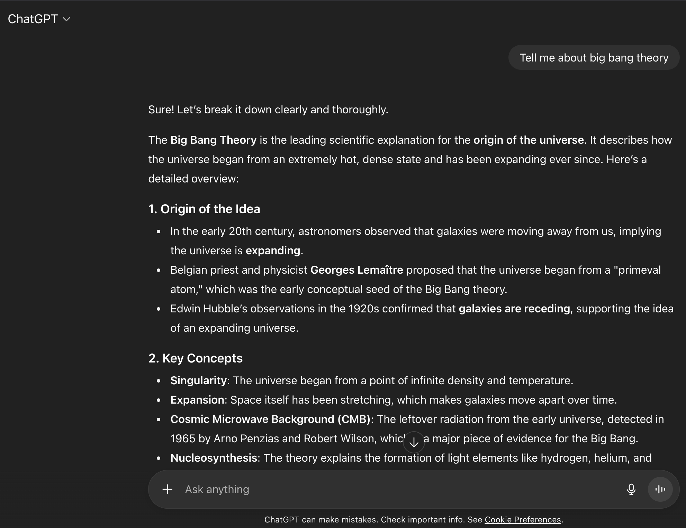
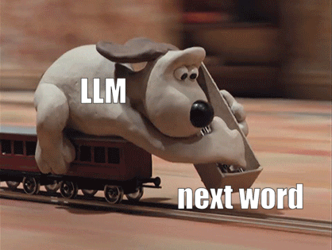
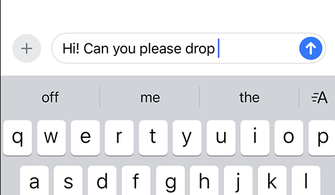
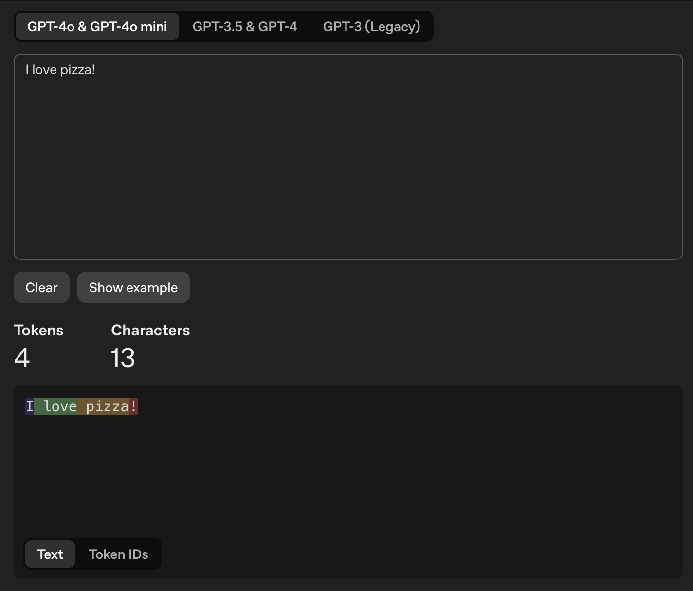
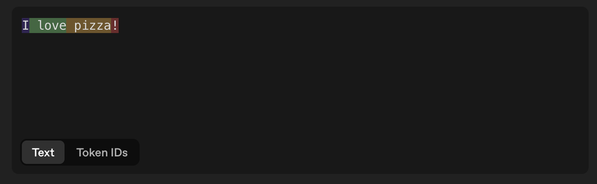
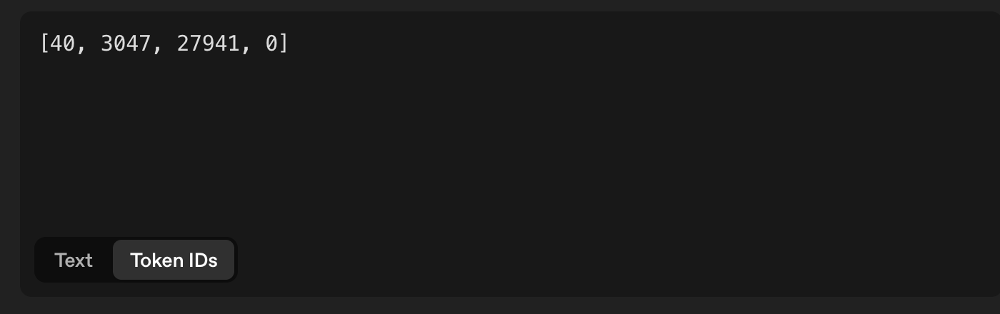
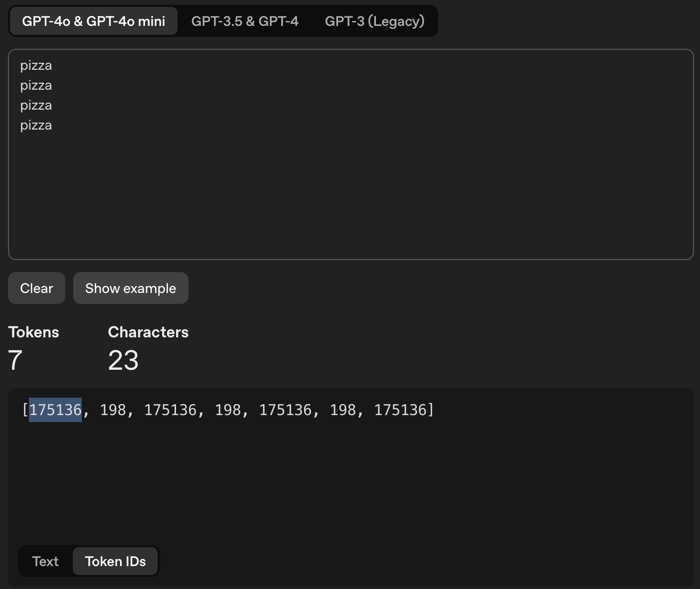
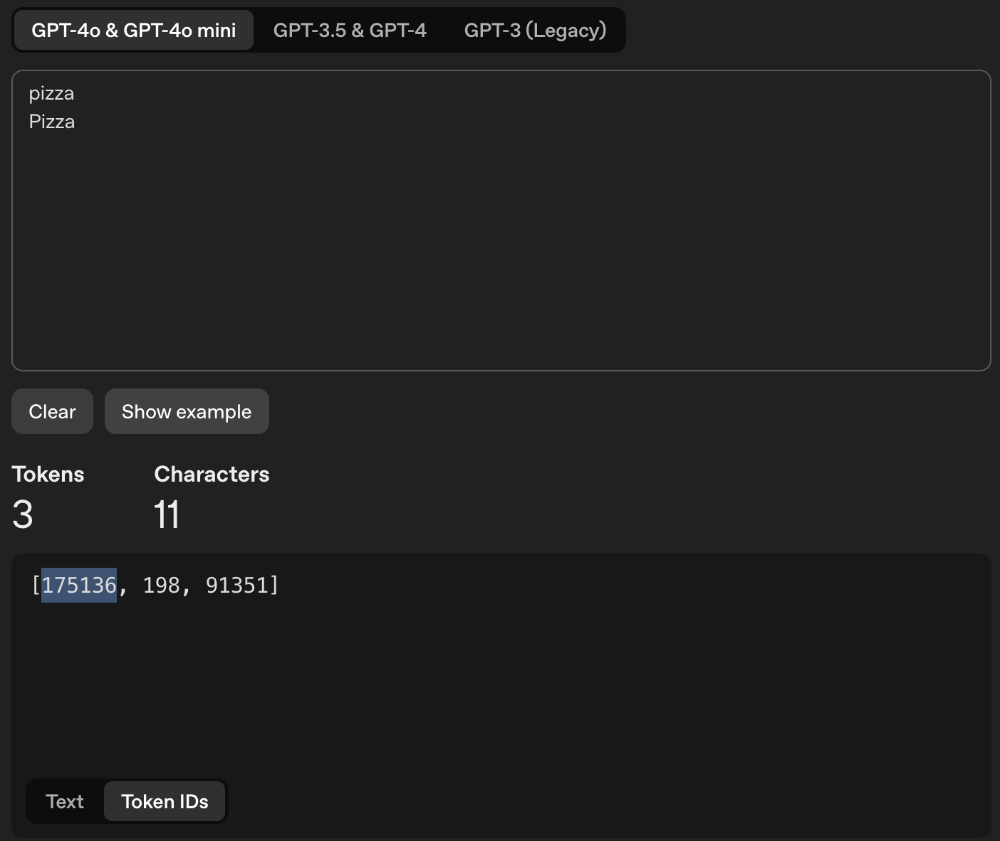
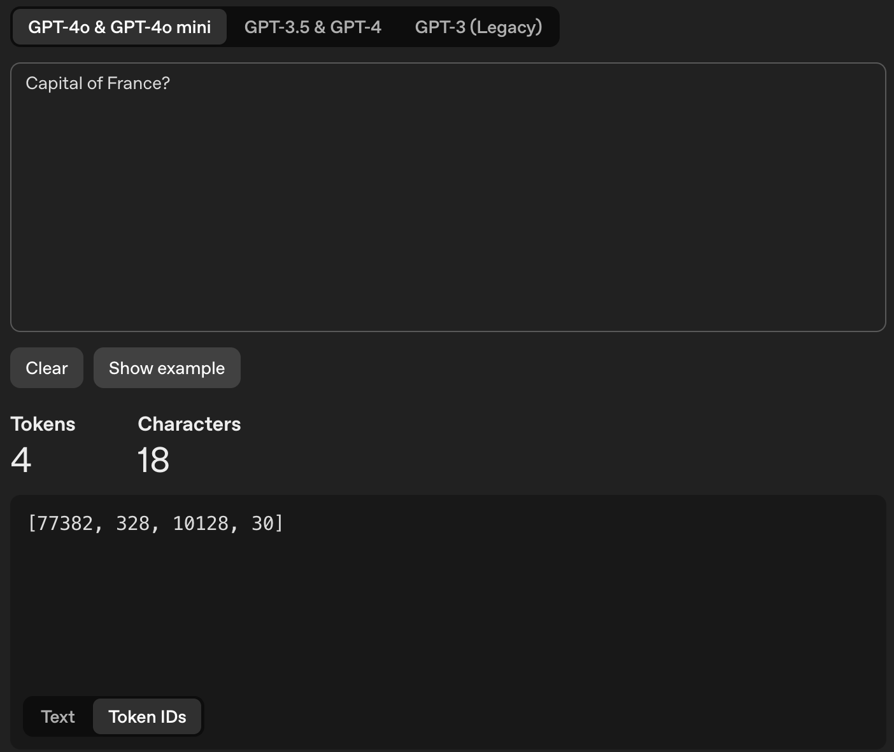
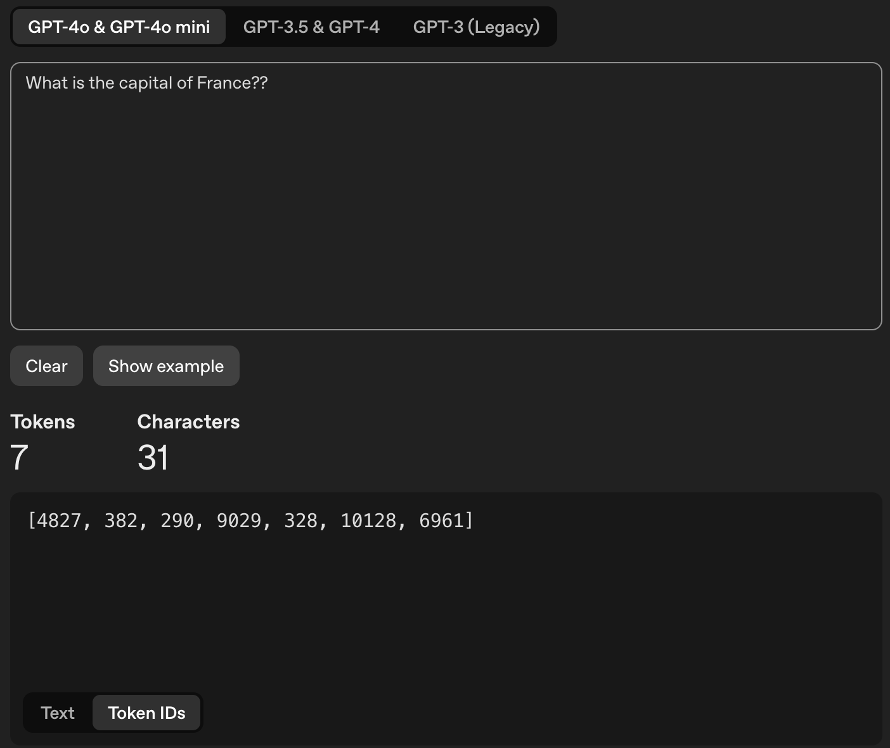

# How Large Language Models (LLMs) Work

Large language models (LLMs) are everywhere these days, but for most people they remain a bit of a mystery. In this guide, we’ll break down how they work in a simple, intuitive way. We’ll start with the big picture and then go step by step into the details, highlighting the key ideas that not only explain what’s going on under the hood but also show you how to get the most out of them.

## LLMs are fancy autocomplete systems

LLMs such as OpenAI’s ChatGPT and Anthropic’s Claude are AI-powered assistants. When you give them a query or instruction — called a `prompt` — they generate a response tailored to that input.
 
<br>

Here’s how LLM works: when you give an LLM a prompt, it generates text - one word at a time. After predicting a word, it adds that word to the prompt and uses the updated prompt to predict the next word. This process repeats again and again until it produces a full response.



This basically means that LLMs are just autocomplete systems trained to predict the next word in a sequence based on the words that came before it. This is similar to how your phone's keyboard suggests the next word as you type a message.

<br>

So why do LLMs seem so smart while your phone’s autocomplete can feel… well, silly? The difference comes down to training. LLMs are powered by transformer-based neural networks trained on massive datasets containing trillions of words, allowing them to learn complex patterns and relationships between words. This enables them to generate coherent and contextually relevant responses.

## LLMs operate on tokens, not words

Saying that LLMs predict the next `word` is not actually accurate. LLMs don’t see words. They have never seen a word. What they see are called `tokens`. A token is the smallest unit of text that a LLM can read, process and respond.

A token could be:
* A full word (`apple`)
* Part of a word (`ing` in `running`)
* Punctuation (`.` or `,`)
* Even a single character in some cases

For example, the sentence:
```
I love pizza!
```
might be broken into tokens like:
```
["I", " love", " pizza", "!"]
```

<br>

or in other tokenization schemes:
```
["I", " lov", "e", " pi", "zza", "!"]
```

## The importance of understanding Tokenization

The process that converts a `string` into a sequence of discrete tokens is called `tokenization`. Different LLMs use different tokenization methods, which can lead to variations in how text is broken down into tokens.

Also note that LLMs are based on artificial neural networks (ANNs) -- which can only process numbers (integers and fractions or floats); they don’t quite understand text or strings. To handle this, tokenizers use a `vocabulary` that maps each token to a unique token ID. For example:
```
"I"      ->  40
" love"  ->  3047
" pizza" ->  27941
"!"      ->  0
```
<br>
<br>

**The token ids is what’s actually sent to the LLM.**

Important notes on token IDs for a given LLM:
- Same string tokens will always result in same token IDs.
    <br><br><br><br>
- Same token string but differently cased (e.g. "Pizza" vs "pizza") will return different token IDs.
    <br><br>
- LLMs receive their input in the form of sequence of token-ids. A small change in the text that may not be perceived by humans can result in a completely different sequence of ids sent to LLMs, which may result in a completely different output generated.
    <br><br><br><br>
    <br><br><br><br>
 

## LLMs generate probabilities, not words

When you ask an LLM a question, it doesn’t actually “know” the answer in the way a human does. Instead, it generates a list of possible next words along with their probabilities based on the context of your prompt. It then selects the word with the highest probability and adds it to the response.

## References
- https://amgadhasan.substack.com/p/explaining-how-llms-work-in-7-levels
- https://medium.com/data-science-at-microsoft/how-large-language-models-work-91c362f5b78f
- https://old.reddit.com/r/artificial/comments/1bh38a0/why_do_llms_give_different_responses_to_the_same/kvb4rl8/
- https://gist.github.com/kalomaze/4473f3f975ff5e5fade06e632498f73e
- https://cobusgreyling.medium.com/openai-seeding-model-fingerprints-log-probabilities-cedf094e8b02