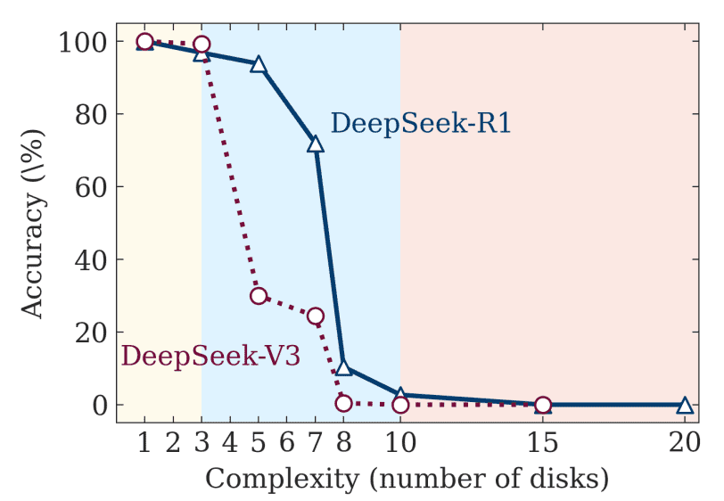

## The Illusion of Thinking: Do LLMs Really Reason?

When you see a thinking model (a.k.a Large Reasoning Model) like ChatGPT 5 or Claude Sonnet 4.5 working through a complex problem step-by-step, showing its "thought process" before arriving at an answer, it feels like watching someone genuinely reason through a puzzle. It seems that these models seem to think and reason like we do. But do they?

The 2025 research paper from Apple called "The Illusion of Thinking" challenged this assumption and sparked one of the most important debates in AI: whether these models truly reason or are just very good at faking.

Here's how reasoning models work:
- Break down problems into steps ("I'll first calculate X, then use that to find Y")
- Explain their logic ("I did this because...")
- Sometimes backtrack and reconsider ("Aha! I made a mistake earlier.")
- Use tools (like calculators or search engines) and code interpreter to solve problems and verify answers.

The idea is simple: by making the model externalize its reasoning process, it should become more accurate and reliable on complex tasks.

### The Apple Research

To test whether LRMs can truly reason, Apple researchers took a few familiar puzzles—Tower of Hanoi, River Crossing problems, Checker Jumping, and Blocks World. These puzzles are perfect for testing because:
- They have clear, correct answers
- Complexity can be controlled by increasing the number of elements or steps
- Even with increasing complexity, the core logic remains the same.

Here's what they found:

1. **The Complexity Wall: Complete Collapse Beyond a Threshold**: 
    
    When the number of elements in the puzzles were small (like 3 disks in Tower of Hanoi), LRMs performed well, often better than standard LLMs. But as complexity increased (5 disks, 7 disks, etc.), performance didn't just degrade —it crashed to zero accuracy. LRMs not just struggled; they completely failed to solve the problems.
    
     

    This happened regardless of how many tokens (how much "thinking space") the model had available.

1. **The Giving Up Phenomenon: Strange Scaling Behavior**
    
    Here's what's truly bizarre: LRMs initially used more tokens as problems got harder, like they were "thinking harder." But once problems crossed a certain complexity threshold, they suddenly used fewer tokens—as if they were giving up before even trying.
    
    It's like watching someone attempt increasingly difficult math problems: at first they show more work as problems get harder, then suddenly they just write down a random answer without trying.

1. **Algorithm Blindness**: Even when explicitly given algorithms (like the recursive solution for Tower of Hanoi), LRMs didn't consistently apply them. This suggests they're not actually executing logical procedures—they're generating text that resembles following procedures.

1. **Overthinking on Easy Tasks**: LRMs often found the correct answer early in their reasoning but kept "thinking" anyway—sometimes talking themselves into wrong answers. Like a student who solves a problem correctly, then second-guesses themselves into an error.

### Apple's Conclusions

The research identified three distinct zones:
- **Low Complexity**: Non-reasoning models are equal or better, because reasoning models sometimes “overthink” themselves into a wrong answer
- **Medium Complexity**: LRMs had a clear advantage. The structured reasoning helped.
- **High Complexity**: Both model types failed completely. The reasoning ability just... stopped working, no matter how much time you give it.

<em>Current AI models are not steadily progressing toward human-like reasoning—they're excelling at pattern-matching and text generation while hitting hard walls on genuine complexity.</em>

